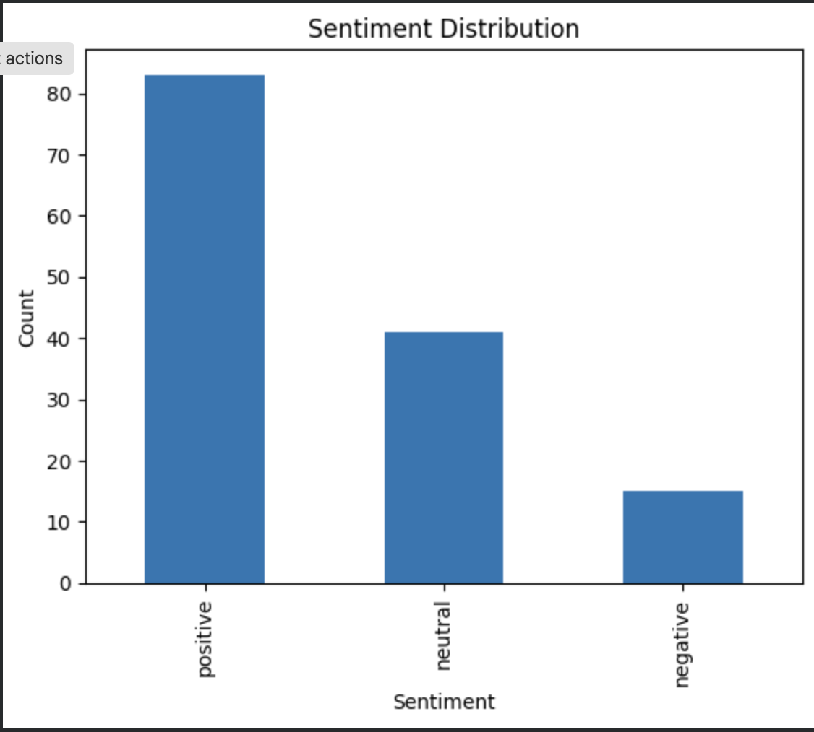
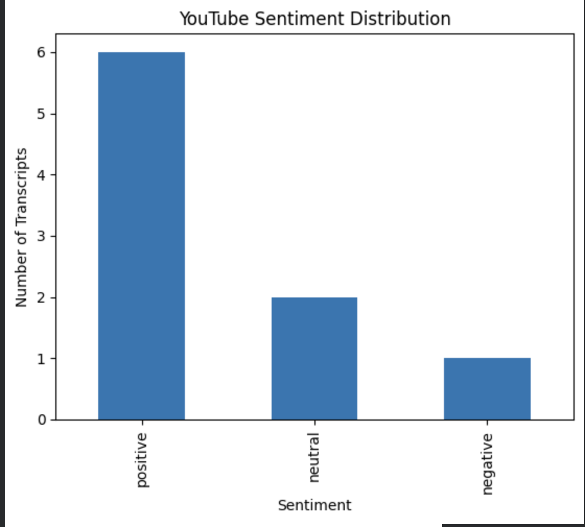
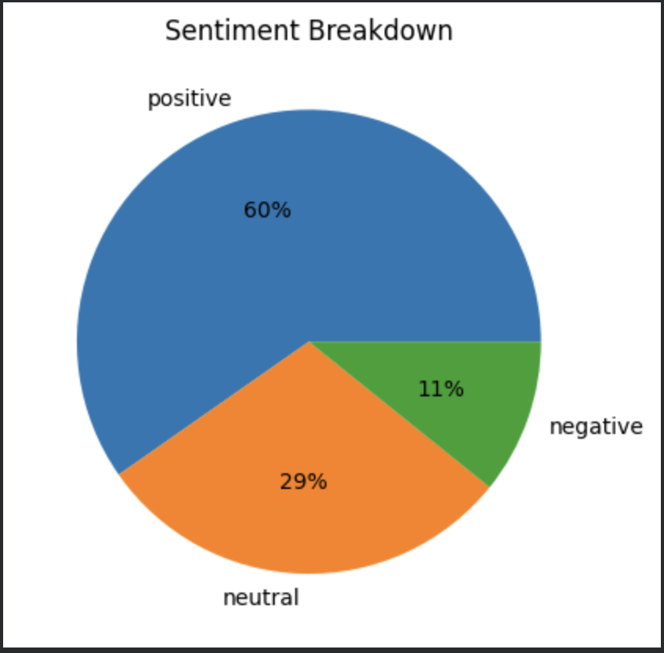
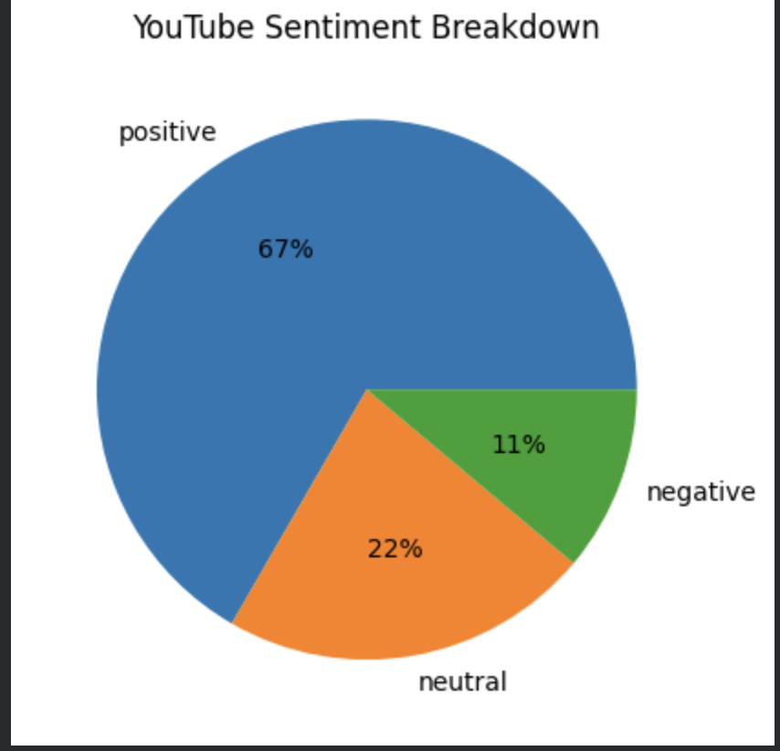
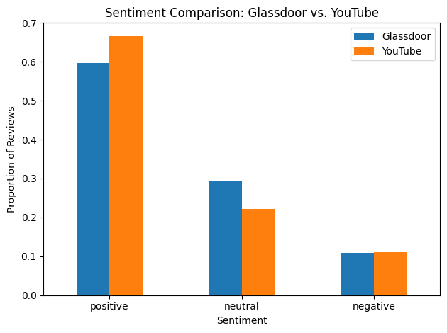

# Amazon Fulfillment Center — Employee Voice Analysis

Text analysis of Amazon fulfillment associate feedback from two public sources — Glassdoor reviews and YouTube "day in the life" videos — to surface the themes and sentiment behind employee retention.

## Why this project

Companies collect far more employee feedback than anyone has time to read. This project treats Glassdoor and YouTube as two different lenses on the same workforce — one written and retrospective, one spoken and in-the-moment — and uses NLP to turn hundreds of individual reviews into patterns a decision-maker could act on, and to see where the two sources agree or disagree.

## Data

| Source | Volume | Notes |
|---|---|---|
| Glassdoor | 139 reviews with usable text | Amazon Fulfillment Center reviews (Glassdoor.ca), collected manually |
| YouTube | 10 videos → 9 with usable transcripts | First-person "day in the life" / warehouse-shift videos |

Raw, cleaned, and sentiment-scored data files are excluded from this repo (see `.gitignore`) since they're scraped third-party content, not original data. The code here is fully documented and reproducible against your own export of the same sources.

## Pipeline

| Notebook | What it does |
|---|---|
| `01_glassdoor_data_cleaning.ipynb` | Loads raw Glassdoor export, audits missing values, drops 6 empty/constant columns (28 → 22) |
| `02_text_cleaning.ipynb` | Builds a reusable `clean_text()` function (lowercase → strip punctuation → remove NLTK stopwords) and applies it to 4 Glassdoor review fields and the YouTube transcript field |
| `03_keyword_analysis.ipynb` | Tokenizes cleaned text, counts word/bigram frequency, and visualizes results (bar charts + word clouds) per platform |
| `04_sentiment_analysis.ipynb` | Scores polarity and subjectivity with TextBlob and labels each Glassdoor review and YouTube transcript positive/neutral/negative, with bar and pie charts per platform |
| `05_sentiment_comparison.ipynb` | Loads the two scored datasets, normalizes the sentiment split for each, and compares Glassdoor and YouTube side by side |

## Findings

### Keyword analysis

**Glassdoor** — compensation and benefits dominate the positive language. Top bigrams: `good pay`, `good benefits`, `place work`.

**YouTube** — a schedule/fatigue theme not visible in the written reviews: `shift`, `night`, `hours`, `tired`, `sleep` cluster together, alongside `enjoy` and `worth`, suggesting the job is physically demanding but not universally disliked. Sample size is small (9 transcripts), so this is read as a theme worth investigating further, not a confirmed pattern.

### Sentiment analysis

Each document was scored with TextBlob (polarity from -1 to +1, subjectivity from 0 to 1) and labeled **positive** (polarity > 0.1), **negative** (< -0.1), or **neutral** (in between).

| Source | Positive | Neutral | Negative |
|---|---|---|---|
| Glassdoor (n = 139) | 83 (60%) | 41 (29%) | 15 (11%) |
| YouTube (n = 9) | 6 (67%) | 2 (22%) | 1 (11%) |

> With only 9 YouTube transcripts, each video moves the split by about 11 percentage points, so counts matter more than percentages there.

| Glassdoor | YouTube |
|---|---|
|  |  |
|  |  |

### Glassdoor vs. YouTube

| Sentiment | Glassdoor | YouTube | Gap (YouTube − Glassdoor) |
|---|---|---|---|
| Positive | 59.7% | 66.7% | +7.0 pts |
| Neutral | 29.5% | 22.2% | −7.3 pts |
| Negative | 10.8% | 11.1% | +0.3 pts |

Negative sentiment is almost identical on both platforms (about 11%). The only visible difference is a modest shift from neutral to positive on YouTube, and with 9 transcripts that shift equals about one video.

**Key takeaways**

1. **Glassdoor leans clearly positive.** 60% of reviews scored positive and only 11% negative. Combined with the keyword results (`good pay`, `good benefits`), the positive tone appears to be tied mostly to compensation and benefits.
2. **YouTube is also mostly positive.** 6 of 9 transcripts scored positive, 2 neutral, and 1 negative, even though the same videos are full of fatigue language (`tired`, `sleep`, `night`).
3. **The two platforms look broadly aligned.** The overall split is similar (60/29/11 vs. 67/22/11), and negative sentiment is nearly identical (10.8% vs. 11.1%). YouTube is about 7 points more positive and 7 points less neutral, but with 9 transcripts that gap is within what one or two videos would change, so this analysis doesn't show a real difference in tone between the platforms.
4. **Sentiment scores can hide the retention risk.** The fatigue and schedule themes in the YouTube keywords don't pull the transcripts' sentiment negative, which suggests that a positive score doesn't mean the strain is absent. Associates can describe a demanding job in a positive or neutral tone, so retention analysis should look at specific themes as well as overall sentiment.

## Data-quality decisions worth noting

A few judgment calls, documented because they'd change the results if made differently:

- **NLTK's stopword list removes negations** (`not`, `no`) along with filler words. `"not interactive"` becomes `"interactive"` — the literal opposite meaning. Handled by treating single-word keyword counts as directional signal, not literal sentiment, and flagging it as a known limitation rather than silently trusting the output. **This also affects sentiment scoring**, since TextBlob reads the cleaned text, so some negative statements are scored as positive.
- **`string.punctuation` is ASCII-only.** It misses curly quotes (`’`) and em dashes (`—`), which are common in copy-pasted review/transcript text and otherwise show up in the keyword list as fake "words." Added a regex pass (`re.fullmatch(r"[a-z]+", w)`) at the keyword-analysis stage to catch what basic punctuation stripping missed.
- **HTML entities survive cleaning.** `&amp;` in raw Glassdoor text degrades to a stray `amp` token rather than being recognized as `&`. Left in at the cleaning stage (documented as a deliberate lightweight-cleanup tradeoff) and filtered out at the keyword-analysis stage instead.
- **Same filtering rules on both platforms** so the Glassdoor/YouTube comparison isn't an artifact of one dataset being cleaned more aggressively than the other.
- **Which text was scored.** Glassdoor sentiment uses a single combined field built from the cleaned summary, advice to management, pros, and cons text, so each review gets one score. Reviews with no text in any of those fields were dropped before scoring. YouTube sentiment uses each video's full cleaned transcript.

## Limitations

- **TextBlob is lexicon-based.** It scores words, not context, so sarcasm, mixed feelings, and negation are handled poorly. Results are best read as a rough emotional read, not an exact measure.
- **Pros and cons are blended.** A review with strong pros and strong cons averages to near-neutral, which can hide polarized opinions.
- **Text length differs a lot between sources.** TextBlob averages across the whole text, so a long transcript and a short review aren't scored on equal footing. Any Glassdoor vs. YouTube comparison should be read with that in mind.
- **Small YouTube sample.** With 9 transcripts, YouTube findings are directional only.
- **Collected, not random, samples.** Both sources are self-selected (people who chose to post), so they don't represent all associates.

## Tech stack

Python · pandas · NLTK · TextBlob · Matplotlib · WordCloud · Google Colab

## Status

- [x] Data collection & structuring
- [x] Text cleaning
- [x] Keyword frequency analysis
- [x] Sentiment scoring (TextBlob)
- [x] Cross-platform insight summary
